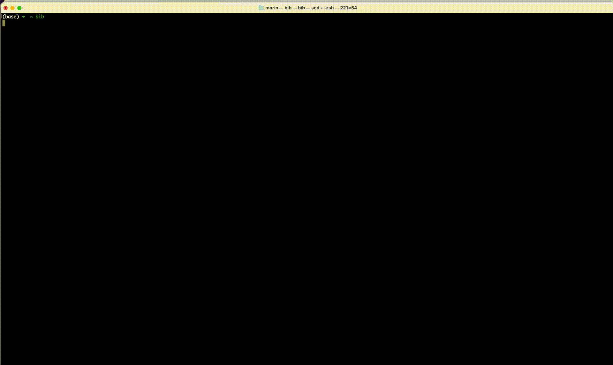

# BibExplorer


Hate the UI of reference managers? Want to minimal reference manager that is easy to use? BibExplorer is for you!

A minimalist command-line BibTeX reference manager that provides fast searching, previewing, and accessing academic papers with a clean and efficient interface. Designed for researchers who prefer terminal-based workflows to navigate their literature collection seamlessly.

## Demo



## Features

- Fast searching through BibTeX entries using fuzzy matching
- Preview entry details including title, author, year, and keywords
- Open PDFs directly from search results
- Copy citation keys with a single keystroke
- Open URLs associated with references
- Debug mode for examining BibTeX database structure

## Requirements

- fzf
- grep
- sed

## How to Use

### Setup

1. Copy the BibExplorer functions (from `BibExplorer.sh`) to your `.zshrc` or `.bashrc` file
2. Create a directory structure:
   ```
   ~/papers/
   ├── refs.bib     # Your BibTeX database file
   └── refs/        # Directory for PDF files
   ```
3. Install the bib_reader Chrome extension

### Getting Papers from arXiv

1. When browsing arXiv, use the bib_reader Chrome extension which:
   - Automatically downloads the PDF
   - Copies the BibTeX citation information to your clipboard

2. Paste the BibTeX entry into your `~/papers/refs.bib` file

3. Move the downloaded PDF to `~/papers/refs/` with the citation key as filename (e.g., `smith2023quantum.pdf`)

4. The bib_reader extension automates most of this workflow, eliminating the need for manual downloading and BibTeX extraction

### Using BibExplorer

1. To search and browse your papers:
   ```
   bib
   ```

2. In the fuzzy search interface:
   - Type to search across keys, titles, authors, years, and keywords
   - Use arrow keys to navigate results
   - Press `Enter` to open the selected paper's PDF
   - Press `Ctrl+Y` to copy the citation key to clipboard
   - Press `Ctrl+O` to open the paper's URL in browser

3. To debug or examine your BibTeX database structure:
   ```
   bibdebug
   ```
   This will display a detailed view of each entry in your database.

### Tips

- Keep your citation keys consistent (e.g., `authorYYYYfirstword`)
- Ensure PDFs are named exactly the same as their citation keys
- Regularly back up your `refs.bib` file

## Disclaimer

All code in this project was generated with the assistance of AI. While efforts have been made to ensure functionality and reliability, this software is provided "as is" without warranty of any kind, express or implied. The authors and contributors shall not be liable for any claim, damages, or other liability arising from the use of the software. Users are responsible for testing and validating the code for their specific needs.
